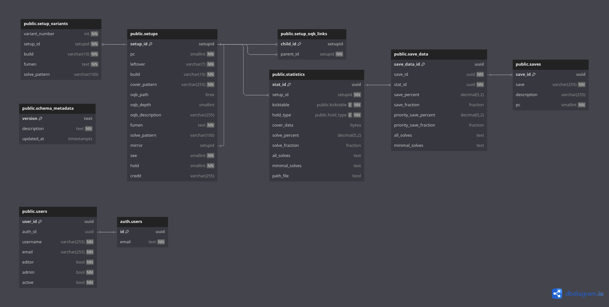

# Database Documentation



## Setups Table

### Terminology

- Leftover - pieces from the bag from the previous PC. Ex: used TSZ to solve PCO and have ILJO on 2nd.
- Build - pieces within the setup.
- Cover Pattern - [extended pieces](https://github.com/Marfung37/ExtendedSfinderPieces) stating the when to build the setup. Ex: OQB may need S < Z for next step.
- Solve Pattern - [extended pieces](https://github.com/Marfung37/ExtendedSfinderPieces) stating what pieces used to solve. This may be related to cover pattern if depends on pieces not placed.

### Setup ID

Goals:

- Effective order
- Representative of setup
- Uniqueness

The ID is a packed 48 bit hexstring, contents in the following table. The pieces are intended to be order by TILJSZO.

| 4b        | 1b  | 3b              | 7b              | 4b                   | 1b          | 14b          | 4b         | 2b                 | 8b        |
| --------- | --- | --------------- | --------------- | -------------------- | ----------- | ------------ | ---------- | ------------------ | --------- |
| PC Number | OQB | Duplicate Piece | Leftover Pieces | Pieces Left to Solve | 4 Duplicate | Piece Counts | Fumen Hash | Cover Pattern Hash | Unique ID |

The leading values determines the order and grouping of setups by the ID with larger is later.

- PC Number - takes values 1-9 for 1st to 9th PC. This also allows ease to determine what PC the setup is from the ID.
- OQB - flag whether the setup is oqb. This puts oqb setups after the non-oqb setups and groups them together.
- Duplicate Piece - maps the duplicate leftover piece to a number. To have O later, O -> 7, T -> 1, and no duplicate -> 0. This puts the non duplicate leftover before the duplicates.
- Leftover Pieces - inverted bit map whether each piece is in the leftover. To have O later, T -> 1st bit unset and O -> 7th bit unset. This puts the leftover following TILJSZO order.
- Pieces Left to Solve - 10 - number of build pieces. This puts more pieces earlier and less pieces later.
- 4 Duplicate - flag whether there's 4 duplicate piece in the build, which only only occur in 5th or 7th PC. In addition, it's not possible for 4 duplicate piece and 3 duplicate of another, so the piece with 3 duplicate in Piece Counts with this flag set actually has 4 of that piece.
- Piece Counts - inverted count for 2 bits for each piece ordered TILJSZO to have O later. This puts the build following TILJSZO order.
- Fumen Hash - hashes the fumen for the setup into 4 bits.
- Cover Pattern Hash - hashes the cover pattern into 2 bits.
- Unique ID - decrement from 255 if there is a collision to maintain uniqueness.

Hashing functions

```python
def fumen_hash(fumen: str) -> int:
    fumen_encoded = fumen[5:-8].encode() # take reasonably random section
    h = len(fumen_encoded)
    for byte in fumen_encoded:
        h = ((h << 3) | (h >> 4)) & 0x7F # more mixing
        h ^= byte
    return h & 0b1111

def cover_pattern_hash(cover_pattern: str) -> int:
    cover_pattern_encoded = cover_pattern.encode()
    h = len(cover_pattern_encoded)
    for byte in cover_pattern_encoded:
        h ^= byte
    return h & 0b11
```

The functions were determined by testing the function's hashes entropy on data and making modifications that increased the entropy.
The entropy was computed for all fumens in the original dataset and the worst case of one piece per fumen, and `cover_pattern_hash` is more focused on when same everything except for the cover pattern in setup. The results may be bias for cover pattern as intended to increase the entropy for specifically these setups on creation.

Fumens:

```
Number of Original Fumen Entries: 4109
Entropy: 3.9917517745354885 out of a maximum of 4.0

Number of One Piece Fumen Entries: 162
Entropy: 3.9227741499296895 out of a maximum of 4.0
```

Cover Dependence:

```
Number of Entries starting with 50f2eff6f[2-7]: 7
Entropy: 1.9502120649147467 out of a maximum of 2.0

Number of Entries starting with 50f2eff6f[0-3]: 7
Entropy: 1.9502120649147467 out of a maximum of 2.0
```

Example Setup ID: the following data
| PC Number | Leftover | Build | Cover Dependence | Fumen | OQB |
| --------- | -------- | ----- | ---------------- | ------------------------------------ | --- |
| 2nd | TTIO | TIO | T,[TIO]! | v115@9gwhIewhIewhEewwAeRpwhDeywRpJeAgH | false |

- `Duplicate Piece` is `001` as mentioned before `O` -> `111` and `T` -> `001`, no dup -> `000` and have duplicate `T`.
- `Leftover Pieces` is `0011110` as `T` is in the leftover -> 1st bit unset, `I` is in leftover -> 2nd bit unset, and `O` is in leftover -> 7th bit unset.
- `Pieces Left to Solve` is `0111` as 7 pieces left to solve. This is the same as `10 - len(Build)`.
- `4 Duplicate` is `0` as there is not 4 of the same piece in the build.
- `Piece Counts` is `10101111111110` as one `T` -> `10`, one `I` -> `10`, zero `L` -> `11`, ..., one `O` -> `10`.
- `Fumen Hash` is `0100` from running the function on the fumen.
- `Cover Pattern Hash` is `01` from running the function on the cover pattern.
- `Unique ID` is `11111111` as no other setup has the same `40` bits. If there was, it would decrease for each earlier setup with same first `40` bits.

| 4b        | 1b  | 3b              | 7b              | 4b                   | 1b          | 14b            | 4b         | 2b                 | 8b        |
| --------- | --- | --------------- | --------------- | -------------------- | ----------- | -------------- | ---------- | ------------------ | --------- |
| PC Number | OQB | Duplicate Piece | Leftover Pieces | Pieces Left to Solve | 4 Duplicate | Piece Counts   | Fumen Hash | Cover Pattern Hash | Unique ID |
| 0010      | 0   | 001             | 0011110         | 0111                 | 0           | 10101111111110 | 0100       | 01                 | 11111111  |

Coverting to hex: `001000010011110011101010111111111001000111111111` -> `213ceaff91ff`

### OQB

The `oqb_path` and `oqb_depth` help with handling OQB setups.

If a setup is not OQB, `oqb_path` and `oqb_depth` are `NULL`.

On insert, the `oqb_path` may be set to the same value as `setup_id` to state setup is OQB. This is only necessary when `solve_pattern` to be `NULL` for the setup isn't intended to be solved from this point.

The `oqb_path` is populated as a [materialized/label path](https://www.postgresql.org/docs/current/ltree.html), which makes querying the tree more efficent, from the `setup_oqb_links` table that contain the parent for each setup.

### Cover Pattern

The cover pattern is in [extended pieces](https://github.com/Marfung37/ExtendedSfinderPieces) and used to restrict what queues that the setup covers.

The cover pattern does not need to be exactly the correct coverage. The `cover_data` in `statistics` is a bitstring for which queue the setup is covered.

## Setup Variants Table

Some setups, especially one-solve or QB setups, have effectively the same setup but some pieces may be placed before completing the base setup.

The following image should give clarity,


The first page with the least pieces is the base and the other pages are the variants. These simply contains other pieces that can be place without affecting the setup in a way that would affect its statistics and increases the cover of the setup.

## Statistics Table

Since the values of a setup depends on the kicktable or have 180, this table separates the statistics for each kicktable.

This stores the `cover_data`, solve percent/fraction, and solves.

### Path File

The `path_file` is a flag whether the `path.csv` file is stored on the server.

The file is stored with the filename `<setup-id>-<kicktable>.csvd.xz`, which is a compressed version of the file.

The basic idea on how to compress the file is to have the fumens keyed by a number then store the mapping at the beginning.
In addition, remove columns that can be computed from the other columns, which the queues can be compressed into the extended pieces notation that generated it at the beginning of the file.
Then apply `xz` or the underlying `lzma` for compression of the file. This converts the 1-3 MB file into 5-150 KB file.

The following function is the actual implementation.

```ts
/**
 * Compress path file
 */
export async function compressPath(filename: string, pieces: string): Result<Buffer> {
  const inputCsv = fs.readFileSync(filename, 'utf-8');
  const records: Record<string, string>[] = parse(inputCsv, {
    columns: true,
    skip_empty_lines: true
  });

  records.sort((a, b) => queueKey(a['ツモ']) - queueKey(b['ツモ']));

  const fumens: Record<string, number> = {};

  for (const row of records) {
    const rowFumens = row['テト譜'].trim().split(';');
    for (let i = 0; i < rowFumens.length; i++) {
      const f = rowFumens[i];
      if (!(f in fumens)) {
        fumens[f] = Object.keys(fumens).length;
      }
      rowFumens[i] = fumens[f].toString();
    }
    row['テト譜'] = rowFumens.join(';');
    row['未使用ミノ'] = mapSaves(row['未使用ミノ']).toString();

    delete row['ツモ'];
    delete row['対応地形数'];
    delete row['使用ミノ'];
  }

  const fumensKeys = Object.keys(fumens);
  const outputLines = [
    pieces,
    '',
    ...fumensKeys,
    '',
    stringify(records, {
      header: true,
      columns: Object.keys(records[0])
    }).trim()
  ];

  try {
    const compressed = await lzma.compress(Buffer.from(outputLines.join('\n')), { preset: 9 });

    // Validate output (though lzma-native should always return Buffer)
    if (!Buffer.isBuffer(compressed)) {
      return { data: null, error: new Error('Compression returned invalid data') };
    }

    return { data: compressed, error: null };
  } catch (err) {
    const error = err instanceof Error ? err : new Error(String(err));
    error.message = `Compression failed: ${error.message}`;

    return { data: null, error };
  }
}
```

## Saves Table

This table is to store save data following the notation used in [PC-Saves-Get](https://github.com/Marfung37/PC-Saves-Get) stored in `save` column.

Priority save percent/fraction is values in an array of the priority of that save. Ex: `T,I,O` on 2nd and wanted to know percent of getting `T` then remaining percent for `I` then `O`. This corresponds with the `--best-save` flag on [PC-Saves-Get](https://github.com/Marfung37/PC-Saves-Get)
