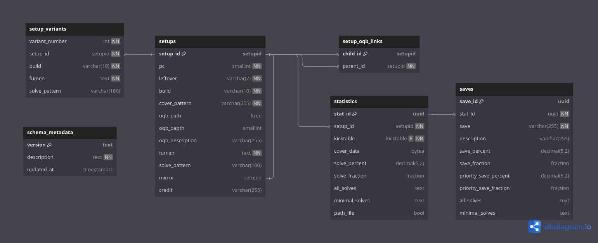

# Database Documentation



## Terminology

- Leftover - pieces from the bag from the previous PC. Ex: used TSZ to solve PCO and have ILJO on 2nd.
- Build - pieces within the setup.
- Cover Dependence - [extended pieces](https://github.com/Marfung37/ExtendedSfinderPieces) stating the when to build the setup. Ex: OQB may need S < Z for next step.

## Setup ID

The ID has three goals: sorting by ID has a effective order, representative of the setup, and unique.

The ID is a packed 48 bit hexstring, contents in the following table. The pieces are intended to be order by TILJSZO.

| 4b        | 1b  | 3b              | 7b              | 4b                   | 1b          | 14b          | 4b         | 2b                    | 8b        |
| --------- | --- | --------------- | --------------- | -------------------- | ----------- | ------------ | ---------- | --------------------- | --------- |
| PC Number | OQB | Duplicate Piece | Leftover Pieces | Pieces Left to Solve | 4 Duplicate | Piece Counts | Fumen Hash | Cover Dependence Hash | Unique ID |

The leading values determines the order and grouping of setups by the ID with larger is later.
- PC Number - takes values 1-9 for 1st to 9th PC. This also allows ease to determine what PC the setup is from the ID.
- OQB - flag whether the setup is oqb. This puts oqb setups after the non-oqb setups and groups them together.
- Duplicate Piece - maps the duplicate leftover piece to a number. To have O later, O -> 7, T -> 1, and no duplicate -> 0. This puts the non duplicate leftover before the duplicates.
- Leftover Pieces - inverted bit map whether each piece is in the leftover. To have O later, T -> 1st bit unset and O -> 7th bit unset. This puts the leftover following TILJSZO order.
- Pieces Left to Solve - 10 - number of build pieces. This puts more pieces earlier and less pieces later.
- 4 Duplicate - flag whether there's 4 duplicate piece in the build, which only only occur in 5th or 7th PC. In addition, it's not possible for 4 duplicate piece and 3 duplicate of another, so the piece with 3 duplicate in Piece Counts with this flag set actually has 4 of that piece.
- Piece Counts - inverted count for 2 bits for each piece ordered TILJSZO to have O later. This puts the build following TILJSZO order.
- Fumen Hash - hashes the fumen for the setup into 4 bits.
- Cover Dependence Hash - hashes the cover dependence into 2 bits.
- Unique ID - decrement from 255 if there is a collision to maintain uniqueness.

Hashing functions
```python
def fumen_hash(fumen: str) -> int:
    fumen_encoded = fumen[5:-8].encode() # take reasonably random section
    h = len(fumen_encoded) 
    for byte in fumen_encoded:
        h = ((h << 3) | (h >> 4)) & 0x7F # more mixing
        h ^= byte
    return h & 0b1111

def cover_dependence_hash(cover_dependence: str) -> int:
    cover_dependence_encoded = cover_dependence.encode() 
    h = len(cover_dependence_encoded)
    for byte in cover_dependence_encoded:
        h ^= byte
    return h & 0b11
```
The difference between the functions is by testing different changes and the effect on the entropy.
The entropy was computed for all fumens in the original dataset and the worst case of one piece per fumen, and `cover_dependence_hash` is more focused on when same everything except for the cover dependence in setup. The results may be bias for cover dependence as intended to increase the entropy for specifically these setups on creation.

Fumens:
```
Number of Original Fumen Entries: 4109
Entropy: 3.9917517745354885 out of a maximum of 4.0

Number of One Piece Fumen Entries: 162
Entropy: 3.9227741499296895 out of a maximum of 4.0
```
Cover Dependence:
```
Number of Entries starting with 50f2eff6f[2-7]: 7
Entropy: 1.9502120649147467 out of a maximum of 2.0

Number of Entries starting with 50f2eff6f[0-3]: 7
Entropy: 1.9502120649147467 out of a maximum of 2.0
```

Example Setup ID: the following data
| PC Number | Leftover | Build | Cover Dependence | Fumen                                | OQB |
| --------- | -------- | ----- | ---------------- | ------------------------------------ | --- |
| 2nd       | TTIO     | TIO   | T,[TIO]!         | v115@9gwhIewhIewhEewwAeRpwhDeywRpJeAgH | false |

- `Duplicate Piece` is `001` as mentioned before `O` -> `111` and `T` -> `001`, no dup -> `000` and have duplicate `T`.
- `Leftover Pieces` is `0011110` as `T` is in the leftover -> 1st bit unset, `I` is in leftover -> 2nd bit unset, and `O` is in leftover -> 7th bit unset.
- `Pieces Left to Solve` is `0111` as 7 pieces left to solve. This is the same as `10 - len(Build)`.
- `4 Duplicate` is `0` as there is not 4 of the same piece in the build.
- `Piece Counts` is `10101111111110` as one `T` -> `10`, one `I` -> `10`, zero `L` -> `11`, ..., one `O` -> `10`.
- `Fumen Hash` is `0100` from running the function on the fumen.
- `Cover Dependence Hash` is `01` from running the function on the cover dependence.
- `Unique ID` is `11111111` as no other setup has the same `40` bits. If there was, it would decrease for each earlier setup with same first `40` bits.

| 4b        | 1b  | 3b              | 7b              | 4b                   | 1b          | 14b            | 4b         | 2b                    | 8b        |
| --------- | --- | --------------- | --------------- | -------------------- | ----------- | -------------- | ---------- | --------------------- | --------- |
| PC Number | OQB | Duplicate Piece | Leftover Pieces | Pieces Left to Solve | 4 Duplicate | Piece Counts   | Fumen Hash | Cover Dependence Hash | Unique ID |
| 0010       | 0   | 001             | 0011110         | 0111                 | 0           | 10101111111110 | 0100       | 01                    | 11111111  |

Coverting to hex: `001000010011110011101010111111111001000111111111` -> `213ceaff91ff`


